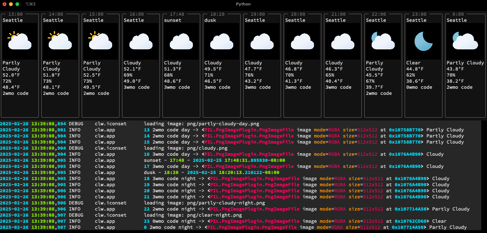

A quick experiement with weather and sunrise times.

**WIP**: This is currently under development, in main branch. Don't expect too much.

## Run

Currently using `uv` for development. See [uv install instructions](https://docs.astral.sh/uv/getting-started/installation/)

```sh
git clone https://github.com/philion/clw
cd clw
uv run clw
```




## Build

Standard [uv build and publish](https://docs.astral.sh/uv/guides/projects/) tools are used.


### To Do

Current near-term implementation plans:
- [ ] day-or-night based on sun rise/set times
- [ ] published to PyPI
- [ ] commandline app packaging with uv support
- [ ] visual high and low temps
- [ ] better text-only *report*
